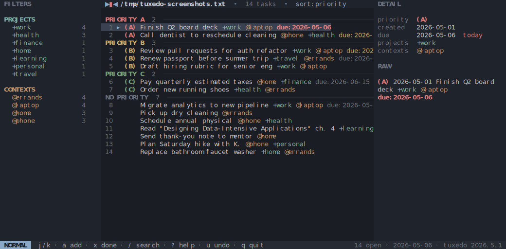
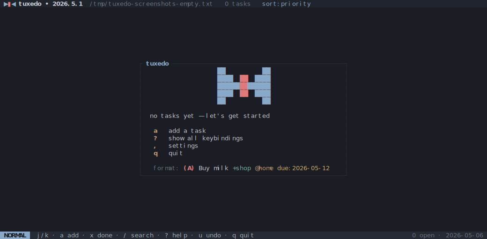
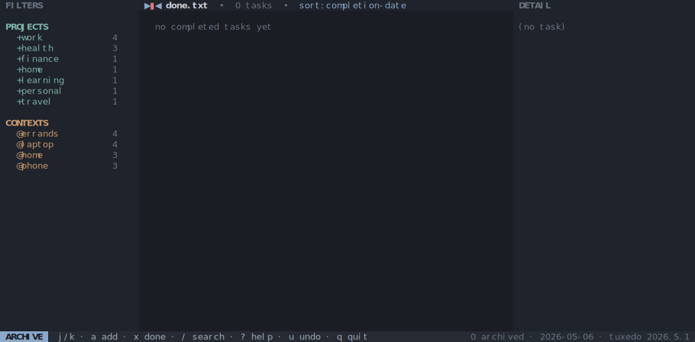
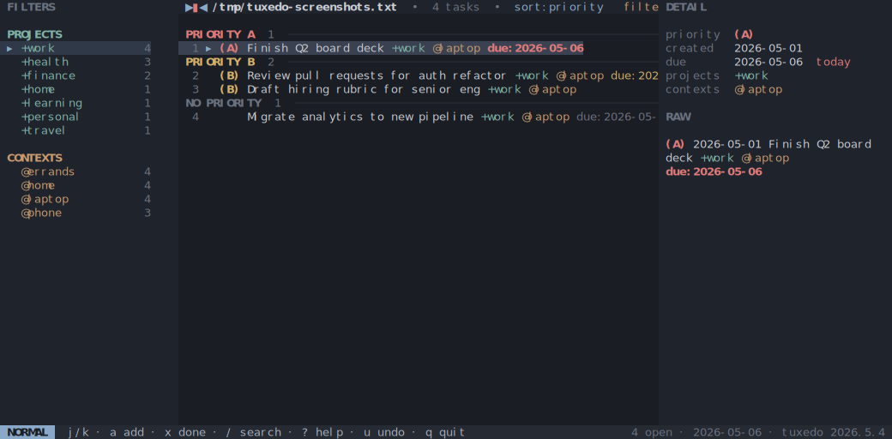
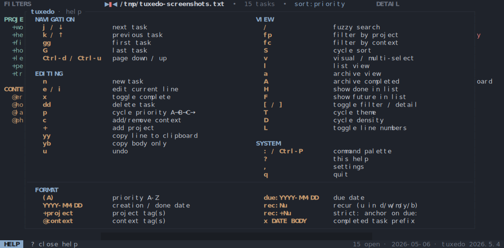
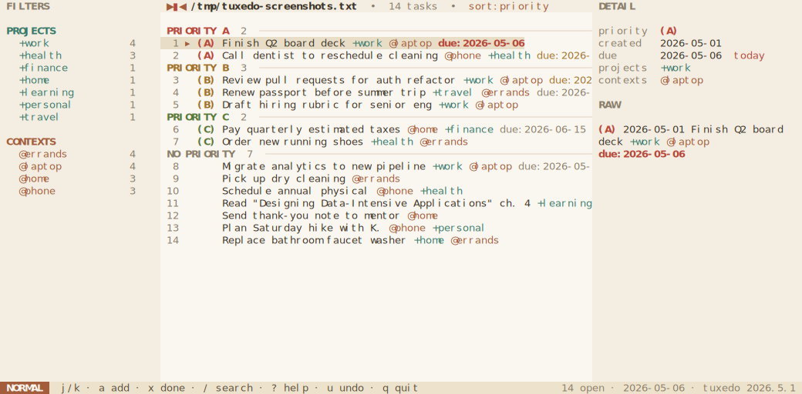
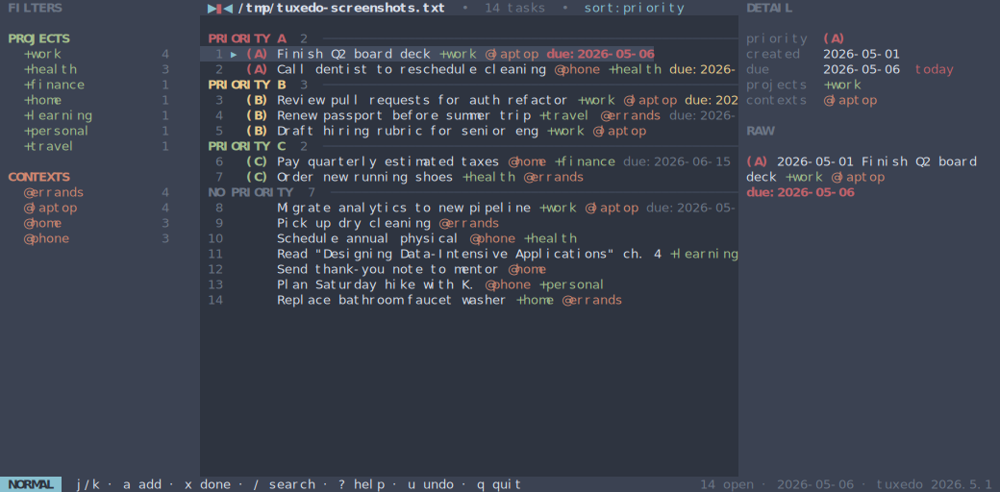
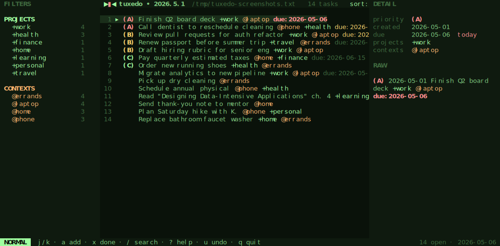

# tuxedo

A fast, keyboard-driven terminal UI for [todo.txt](http://todotxt.org/).
Vim-style bindings, atomic writes, instant external-edit detection, and four
hand-tuned themes — all in a single static binary.

[](https://github.com/webstonehq/tuxedo/actions/workflows/ci.yml)
[](https://github.com/webstonehq/tuxedo/releases/latest)
[](#license)
[](https://www.rust-lang.org)



## Highlights

- **Pure todo.txt.** Reads and writes the [standard format](https://github.com/todotxt/todo.txt) — every line is plain text you can edit with anything else.
- **Vim keys, no surprises.** `j` / `k` to move, `dd` to delete, `gg` / `G` to jump, `u` to undo (50 levels), chord prompts (`gg`, `dd`, `fp`, `fc`) with a 600 ms window.
- **Atomic, sync-friendly writes.** Every change goes through write-temp-then-rename. If another process — Dropbox, an editor, a script — modifies the file, tuxedo reloads on the next keypress (or within ~250 ms while idle) and flashes a notice.
- **Sibling-file archive.** `A` moves completed tasks to `done.txt` next to your file, atomically.
- **Filter, sort, multi-select.** Cycle by `+project` or `@context`, sort by priority / due / file order, and bulk-complete or bulk-delete in visual mode.
- **Four themes, three densities.** Cycle with `T` and `D`. Choices persist across runs.
- **No daemon, no database, no cloud.** One file in, one file out.

## Screens

| | |
| --- | --- |
| **Empty state** • cell-bowtie mark and quick-start when the file has no tasks |  |
| **Archive** • completed tasks grouped by completion date |  |
| **Filter sidebar active** • `fp` cycles projects with j/k, `fc` cycles contexts |  |
| **Help** • `?` opens the full keybindings overlay |  |

<details>
    <summary>How to generate screenshots</summary>
    <p>The screenshots above are checked-in SVGs. Regenerate them with:</p>
    <pre>mise run screenshots</pre>
</details>

## Themes

`T` cycles through four built-in themes.

| Muted Slate (default) | Dawn |
| --- | --- |
|  |  |
| **Nord** | **Matrix** |
|  |  |

## Install

### Homebrew (macOS, Linux)

```sh
brew install webstonehq/tap/tuxedo
```

### Prebuilt binaries

Download the archive for your platform from the [latest release](https://github.com/webstonehq/tuxedo/releases/latest) and put `tuxedo` on your `PATH`.

Targets: `x86_64-unknown-linux-gnu`, `aarch64-unknown-linux-gnu`, `x86_64-apple-darwin`, `aarch64-apple-darwin`, `x86_64-pc-windows-msvc`. Each archive ships with a `.sha256` checksum.

### From source

```sh
cargo install --git https://github.com/webstonehq/tuxedo
```

Or clone and build:

```sh
git clone https://github.com/webstonehq/tuxedo
cd tuxedo
cargo build --release
./target/release/tuxedo [FILE]
```

Requires the Rust 2024 edition (recent stable toolchain).

## Usage

```sh
tuxedo [FILE]      # open FILE (created if missing)
tuxedo             # open ./todo.txt, or a sample file if none
tuxedo --sample    # open the bundled sample file in the temp dir
tuxedo --help
tuxedo --version
```

If `FILE` is omitted, tuxedo opens `./todo.txt` from the current working
directory if it exists. Otherwise it falls back to a sample todo.txt in the
system temp directory so you can poke around without committing to a path.

Edits are persisted on every change via atomic write (write `.tmp`, rename).

If the file changes on disk (another editor, a sync client, a script),
tuxedo notices on the next keypress, or within ~250 ms while idle, and
reloads. The keystroke that triggered the reload is consumed — press it
again to act on the fresh state — and the status bar flashes a notice.

Pressing `A` appends every completed task to a sibling `done.txt` and
removes them from the working file (atomically: `done.txt` is written
before the originals are dropped). `a` toggles the archive view so you
can browse, un-archive, or permanently delete past tasks.

## Keybindings

### Navigation

| Key | Action |
| --- | --- |
| `j` / `↓` | next task |
| `k` / `↑` | previous task |
| `gg` | first task |
| `G` | last task |
| `Ctrl-d` / `Ctrl-u` | half-page down / up |

### Editing

| Key | Action |
| --- | --- |
| `n` | add task |
| `e` / `i` | edit current task |
| `x` | toggle complete |
| `dd` | delete task |
| `p` | cycle priority A → B → C → · |
| `c` | add or remove a context |
| `+` | add a project |
| `yy` | copy current line to clipboard |
| `yb` | copy current body only (no priority, dates, projects, contexts, `key:value`) |
| `u` | undo (50 levels) |

### Filtering, sort, view

| Key | Action |
| --- | --- |
| `/` | search |
| `fp` | filter by project (`j` / `k` cycles, `Esc` clears) |
| `fc` | filter by context (`j` / `k` cycles, `Esc` clears) |
| `S` | cycle sort: priority → due → file order |
| `v` | enter visual / multi-select; `space` toggles a row |
| `x` / `dd` (in visual) | bulk-complete / bulk-delete the selection |
| `l` | list (default) view |
| `a` | toggle archive view |
| `A` | archive completed tasks → `done.txt` |
| `H` | toggle showing done tasks in the main list |

### Layout & theme

| Key | Action |
| --- | --- |
| `[` | toggle filter sidebar |
| `]` | toggle detail sidebar |
| `T` | cycle theme |
| `D` | cycle density: compact → comfortable → cozy |
| `L` | toggle line numbers |

### System

| Key | Action |
| --- | --- |
| `?` | help overlay |
| `,` | settings overlay |
| `q` | quit |

Two-key chord prompts (`gg`, `dd`, `yy`, `yb`, `fp`, `fc`) show a `g…` /
`d…` / `y…` / `f…` indicator in the status-bar mode chip while the
leader is armed; the window is 600 ms.

Copy uses the OSC 52 terminal escape, so it works locally and over SSH on
any terminal that supports it (kitty, alacritty, wezterm, iTerm2, foot,
modern xterm; tmux when `set -g set-clipboard on`). Older terminals will
silently ignore the keystroke.

## todo.txt format

Standard [todo.txt](https://github.com/todotxt/todo.txt) lines:

```
(A) 2026-04-28 Call dentist @phone +health due:2026-05-08
```

- `(A)` — priority, A through Z (omit for none)
- `2026-04-28` — creation date in ISO 8601
- `+project` — project tag
- `@context` — context tag
- `key:value` — extension; `due:YYYY-MM-DD` is recognized for sort and
  due-bucket grouping in the list view
- `rec:[+]N{d,b,w,m,y}` — recurrence; on completion (`x`), tuxedo inserts
  a fresh copy of the task with `due:` advanced by `N` days, business
  days (Mon–Fri), weeks, months, or years. The `+` prefix means
  *strict* recurrence anchored to the previous due date (e.g.
  `rec:+1m` for monthly rent on the 15th); without it, the new due is
  computed from the completion date (e.g. `rec:1w` for "water plants
  one week after I last did").

Completed tasks are prefixed with `x ` and a completion date:

```
x 2026-05-05 2026-05-01 Submit expense report +work
```

Recurring example:

```
2026-05-09 Pay rent due:2026-05-15 rec:+1m
```

Pressing `x` on the line above marks the original complete *and* inserts
`2026-05-09 Pay rent due:2026-06-15 rec:+1m`. `u` undoes both at once.

## Configuration

Persisted to `${XDG_CONFIG_HOME:-$HOME/.config}/tuxedo/config.toml`. Cycling
theme, density, or sort, and toggling sidebars / line-numbers / done-visibility
all update the file. Unknown keys are ignored, so older binaries don't break
on newer files.

## Development

```sh
mise run fmt      # cargo fmt --all
mise run clippy   # cargo clippy --all-targets --locked -- -D warnings
mise run test     # cargo test --locked
```

CI runs all three on every push and pull request. Tasks are also runnable as
plain `cargo` commands if you don't use [mise](https://mise.jdx.dev/).

## Acknowledgments

- [todo.txt](http://todotxt.org/) by Gina Trapani — the format that makes a tool like this possible.
- [ratatui](https://ratatui.rs/) and [crossterm](https://github.com/crossterm-rs/crossterm) — the rendering and terminal-input crates tuxedo is built on.

## Roadmap

Planned and in-flight work lives in [`todo.txt`](./todo.txt) — eat your own dog food.

## Contributing

Issues and pull requests are welcome. For larger changes, please open an
issue first to discuss the approach. Run `mise run fmt clippy test` (or the
plain cargo equivalents) before submitting.

## License

Released under the [MIT License](https://opensource.org/licenses/MIT).
