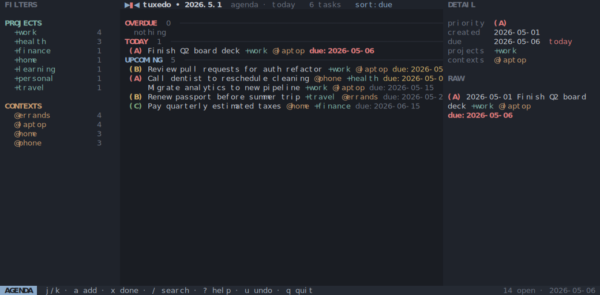

# tuxedo

A terminal UI for [todo.txt](http://todotxt.org/) files. Vim-flavored
keybindings, atomic file writes, external-edit detection, sibling-file
archive, four built-in themes.

## Screens

| | |
| --- | --- |
| **Today / agenda** • overdue, due-today, and upcoming groups |  |
| **Archive** • completed tasks grouped by completion date |  |
| **Filter sidebar active** • `fp` cycles projects with j/k, `fc` cycles contexts |  |
| **Help** • `?` opens the full keybindings overlay |  |

    
How to generate screenshots

    
The screenshots above are checked-in SVGs. Regenerate them with:

    <pre>cargo run --example screenshots</pre>

## Themes

`T` cycles through four built-in themes.

### Muted Slate (default)

### Dawn

### Nord

### Matrix

## Install

    cargo install --path .

Or build locally:

    cargo build --release
    ./target/release/tuxedo [FILE]

## Usage

    tuxedo [FILE]
    tuxedo --sample
    tuxedo --help
    tuxedo --version

If `FILE` is omitted, tuxedo opens `./todo.txt` from the current working
directory if it exists. Otherwise it opens a sample todo.txt in the system
temp directory so you can poke around without committing to a path. Pass
`--sample` to open the sample file explicitly, regardless of the current working directory.

Edits are persisted on every change via atomic write (write `.tmp`, rename).

If the file changes on disk (another editor, a sync client, a script),
tuxedo notices on the next keypress, or within ~250 ms while idle, and
reloads. The keystroke that triggered the reload is consumed — press it
again to act on the fresh state — and the status bar flashes a notice.

Pressing `A` appends every completed task to a sibling `done.txt` and
removes them from the working file (atomically: `done.txt` is written
before the originals are dropped).

## Keybindings

### Navigation

| Key | Action |
| --- | --- |
| `j` / `↓` | next task |
| `k` / `↑` | previous task |
| `gg` | first task |
| `G` | last task |
| `Ctrl-d` / `Ctrl-u` | half-page down / up |

### Editing

| Key | Action |
| --- | --- |
| `a` | add task |
| `e` / `i` | edit current task |
| `x` | toggle complete |
| `dd` | delete task |
| `p` | cycle priority A → B → C → · |
| `c` | add or remove a context |
| `+` | add a project |
| `u` | undo (50 levels) |

### Filtering, sort, view

| Key | Action |
| --- | --- |
| `/` | search |
| `fp` | filter by project (`j` / `k` cycles, `Esc` clears) |
| `fc` | filter by context (`j` / `k` cycles, `Esc` clears) |
| `s` | cycle sort: priority → due → file order |
| `v` | enter visual / multi-select; `space` toggles a row |
| `x` / `dd` (in visual) | bulk-complete / bulk-delete the selection |
| `t` | today / agenda view |
| `A` | archive completed tasks → `done.txt` |
| `H` | toggle showing done tasks in the main list |

### Layout & theme

| Key | Action |
| --- | --- |
| `[` | toggle filter sidebar |
| `]` | toggle detail sidebar |
| `T` | cycle theme |
| `D` | cycle density: compact → comfortable → cozy |
| `L` | toggle line numbers |

### System

| Key | Action |
| --- | --- |
| `?` | help overlay |
| `,` | settings overlay |
| `q` | quit |

Two-key chord prompts (`gg`, `dd`, `fp`, `fc`) show a `g…` / `d…` / `f…`
indicator in the status-bar mode chip while the leader is armed; the
window is 600 ms.

## todo.txt format

Standard [todo.txt](https://github.com/todotxt/todo.txt) lines:

    (A) 2026-04-28 Call dentist @phone +health due:2026-05-08

- `(A)` — priority, A through Z (omit for none)
- `2026-04-28` — creation date in ISO 8601
- `+project` — project tag
- `@context` — context tag
- `key:value` — extension; `due:YYYY-MM-DD` is recognized for sort and
  agenda grouping

Completed tasks are prefixed with `x ` and a completion date:

    x 2026-05-05 2026-05-01 Submit expense report +work

## Configuration

Persisted to `${XDG_CONFIG_HOME:-$HOME/.config}/tuxedo/config.toml`. Cycling
theme, density, or sort, and toggling sidebars/line-numbers/done-visibility,
all update the file. Unknown keys are ignored, so older binaries don't break
on newer files.

## License

MIT (see `Cargo.toml`).
